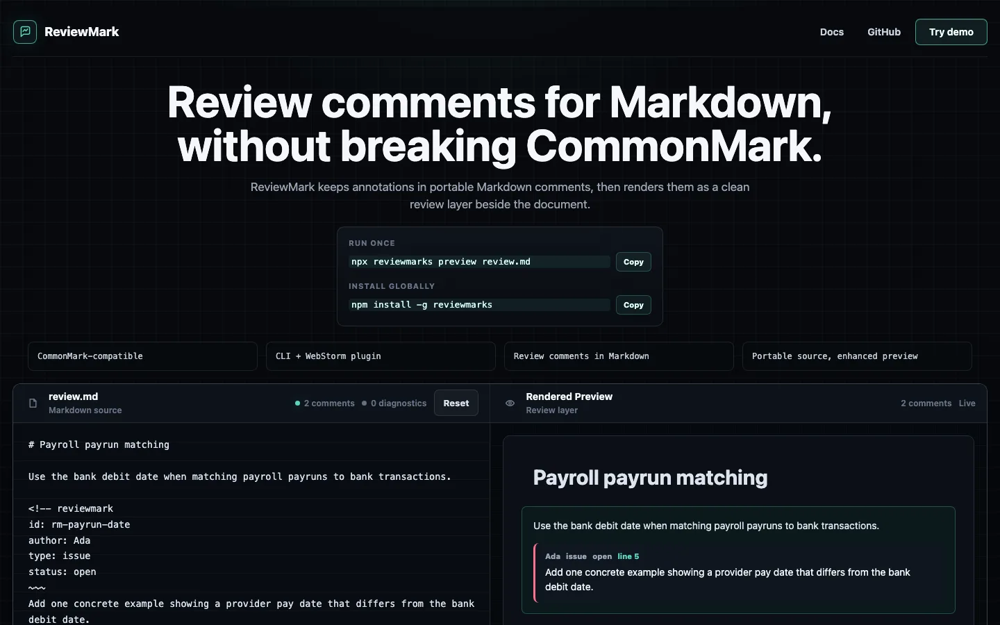

# ReviewMark

ReviewMark is a CommonMark-compatible review-comment extension for Markdown.

It lets humans and AI agents keep review comments inside plain Markdown, then renders those comments as a focused review layer beside the document. Technical docs, specs, and AI-generated plans stay portable text while ReviewMark-aware tools show the annotations.



Live demo: <https://reviewmark.dev>

## Syntax

```markdown
Paragraph being reviewed.

<!-- reviewmark
id: rm-example
author: Claude
type: issue
status: open
~~~
This is the review comment.
-->
```

A ReviewMark comment applies to the nearest previous non-review Markdown block. Supported block targets include headings, paragraphs, lists, blockquotes, code blocks, tables, and thematic breaks.

Supported metadata:

- `id`: optional stable id. Missing ids are generated as `rm_<8-char-hash>` from author, body, and start line.
- `author`: reviewer name. Defaults to `unknown`.
- `type`: `note`, `issue`, `suggestion`, `question`, or `praise`. Defaults to `note`.
- `status`: `open`, `resolved`, or `rejected`. Defaults to `open`.
- `created_at`: optional timestamp.

Legacy `severity` values are accepted for compatibility and normalized internally to `type`.

Use `~~~` as the body separator. The older `---` separator is still parsed for compatibility, but it contains `--`, which is unsafe inside HTML comments and can confuse built-in Markdown previews.

## Install CLI

The CLI is published on npm as [`reviewmarks`](https://www.npmjs.com/package/reviewmarks).

```bash
npm install -g reviewmarks
```

Or run without a global install:

```bash
npx reviewmarks preview spec.md
```

## CLI

```bash
reviewmark list spec.md
reviewmark validate spec.md
reviewmark render spec.md --stdout
reviewmark render spec.md --out spec.review.html
reviewmark render spec.md --watch --out spec.review.html
reviewmark strip spec.md --out spec.clean.md
reviewmark preview spec.md
```

`reviewmark preview` starts a local HTTP server, opens the generated review view in the default browser, watches the Markdown file, and refreshes the browser when the file changes.

## Demo Site

The live demo app lives in `apps/demo` and is deployed at <https://reviewmark.dev>.

```bash
pnpm dev:site
pnpm build:site
```

The site is a static Vite/React app. It reuses the internal `@reviewmark/core` workspace package directly, so the browser playground exercises the same parser and HTML renderer as the CLI and JetBrains plugin.

Vercel deployment is configured in `vercel.json`:

```bash
npx vercel deploy --prod
```

GitHub Pages deployment is also available in `.github/workflows/pages.yml` as a static hosting fallback.

## JetBrains / WebStorm Plugin

The JetBrains plugin lives under `plugins/jetbrains`.

The plugin does not replace WebStorm's built-in Markdown preview. Instead, it provides a ReviewMark Preview tool window that automatically opens when a Markdown file contains `<!-- reviewmark` and renders comments as an IDE-native review layer.

Usage:

1. Install the ReviewMark JetBrains plugin.
2. Open a Markdown file containing `<!-- reviewmark`.
3. ReviewMark Preview opens automatically beside the editor.
4. Save the file to refresh the preview.

Manual preview:

```text
ReviewMark: Open Preview
```

The manual action is available from Search Everywhere, Tools, and the editor context menu.

Current editor actions:

- `ReviewMark: Insert Comment`: inserts a ReviewMark comment below the selected block or current line.
- `ReviewMark: Resolve/Reopen Comment`: toggles the nearest ReviewMark comment between `open` and `resolved`.

Settings:

- Auto-open ReviewMark Preview for Markdown files with comments.
- Node executable path. Leave blank for auto-detection.
- CLI fallback path.

The plugin bundles the ReviewMark renderer, but the bundled renderer currently runs on Node.js. The plugin auto-detects Node from the IDE environment, common macOS/Linux/Windows install locations, and common version-manager paths such as Volta, asdf, nvm, and fnm. If auto-detection fails, set `Node executable path (optional)` explicitly in `Settings` / `Preferences` -> `ReviewMark`.

Limitations:

- The built-in WebStorm Markdown preview is not modified.
- v0.4 supports top-level ReviewMark comments only.
- Refresh happens on save, not every keystroke.
- Editing/resolving from inside the preview itself is not supported yet; use editor actions.
- The bundled renderer runs with Node.js in this version. If bundled rendering fails, the plugin can fall back to the configured external CLI path.

## Install Agent Skill

This repo includes a ReviewMark agent skill at `skills/reviewmark` so Codex, Claude Code, OpenCode, Cursor, and similar agents can learn the comment format.

```bash
npx skills add jingbof/reviewmark --skill reviewmark
```

After installing it, ask your agent:

```text
Review this Markdown file using ReviewMark.
```

## Develop Locally

```bash
pnpm install
pnpm build
pnpm test
pnpm reviewmark help
```

During development you can run the CLI from TypeScript:

```bash
pnpm dev -- preview examples/spec.md
```

Build the JetBrains bundled renderer:

```bash
pnpm build:jetbrains-renderer
```

Build or run the JetBrains plugin from `plugins/jetbrains` with Gradle:

```bash
gradle buildPlugin
gradle runIde
```

If you add a Gradle wrapper locally, the equivalent wrapper commands are `./gradlew buildPlugin` and `./gradlew runIde`.

## Manual Plugin Test Cases

1. Open `examples/pricing.md`; expected: ReviewMark Preview auto-opens.
2. Open `examples/no-reviewmark.md`; expected: no preview auto-opens.
3. Edit `examples/pricing.md` and save; expected: preview refreshes.
4. Close preview and run `ReviewMark: Open Preview`; expected: preview opens again.
5. Break metadata; expected: preview shows diagnostics but does not crash.
6. Disable auto-open in settings; expected: preview does not auto-open.
7. Run manual action with auto-open disabled; expected: preview opens.
